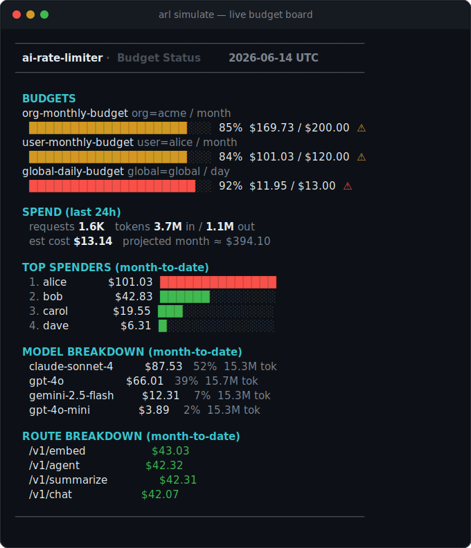
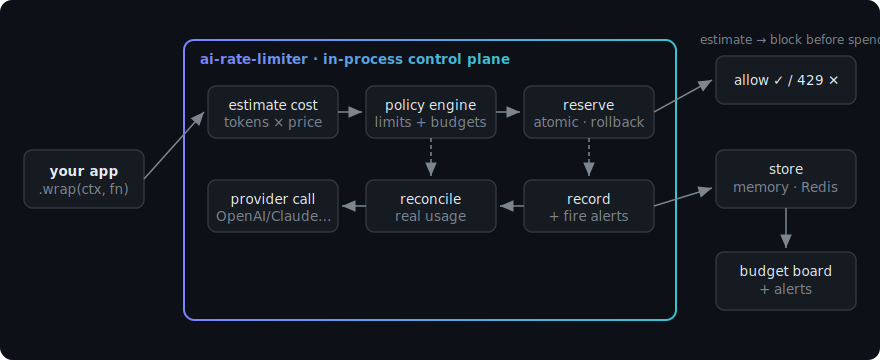

<p align="center">
  
</p>

<p align="center">
  Budgets, token & cost limits, and exact spend tracking for <b>any</b> LLM API —
  <br/>OpenAI · Anthropic (Claude) · Google (Gemini) · Mistral · and anything else.
  <br/>One <code>wrap()</code>. Zero runtime dependencies. In-process or Redis.
</p>

<p align="center">
  <a href="https://github.com/ingridtoulotte/ai-rate-limiter/actions"></a>
  <a href="https://www.npmjs.com/package/ai-rate-limiter"></a>
  
  
  
  =18" src="https://img.shields.io/badge/node-%3E%3D18-43853d.svg?logo=node.js&logoColor=white">
</p>

<p align="center">
  <a href="#-try-it-in-10-seconds">Try in 10s</a> ·
  <a href="#why-this-exists">Why</a> ·
  <a href="#how-it-works">How it works</a> ·
  <a href="#features">Features</a> ·
  <a href="#how-ai-rate-limiter-compares">Compare</a> ·
  <a href="#faq">FAQ</a>
</p>

---

**Rate limiting alone does not protect an LLM bill.** One allowed request can cost 100× another — a long prompt, a long output, an expensive model, a retry storm, an agent stuck in a loop. The damage shows up on next month's invoice.

`ai-rate-limiter` is a drop-in **control plane** for LLM usage. Wrap your provider calls with one API and get per-user/per-org **budgets**, **token & request rate limits**, **exact cost tracking**, **soft-limit alerts**, and a **budget board** — backed by in-memory or Redis, with **zero runtime dependencies**.

```ts
import { RateLimiter, consoleAlert } from "ai-rate-limiter";

const limiter = new RateLimiter({
  policy: {
    limits: [
      { scope: "user", metric: "cost",     limit: 5,      window: "day",    warnAt: [0.8] },
      { scope: "org",  metric: "cost",     limit: 2000,   window: "month",  warnAt: [0.8, 0.95] },
      { scope: "user", metric: "requests", limit: 60,     window: "minute" },
      { scope: "user", metric: "tokens",   limit: 200000, window: "minute" },
    ],
  },
  alerts: [consoleAlert()],
});

// Budget-enforced, cost-tracked call. Throws BudgetExceededError when over limit.
const res = await limiter.wrap(
  { provider: "openai", model: "gpt-4o", userId: "alice", orgId: "acme", input: { messages } },
  () => openai.chat.completions.create({ model: "gpt-4o", messages }),
);
```

That is the whole integration: **one wrap, every guarantee.**

---

## ⚡ Try it in 10 seconds

No install, no API key — render a live budget board with realistic demo data:

```bash
npx github:ingridtoulotte/ai-rate-limiter simulate
```

<p align="center">
  
</p>

> Every number above comes from recorded `UsageEntry[]`. `renderReport(entries, policy)` returns this
> string — serve it in a dashboard, post it to Slack, or print it in CI. Once published to npm it's
> also `npx ai-rate-limiter simulate`.

---

## Why this exists

A single allowed request can cost 100× another. Teams get burned by:

- **invisible token drain** — spend is only discovered on the monthly invoice
- **no per-tenant isolation** — one noisy user/org degrades everyone and the budget
- **unbounded retries & agents** — hot loops quietly multiply cost
- **provider sprawl** — OpenAI, Claude, Gemini and Mistral each report usage differently

`ai-rate-limiter` enforces **cost and token budgets**, not just request counts, across **every provider**, with spend attributed to the user / org / project / model / route that caused it.

---

## How it works

<p align="center">
  
</p>

1. **Estimate** the request cost (input tokens from the body, output from your hint).
2. **Reserve** that estimate against every applicable counter *atomically*. If any limit would be exceeded, all reservations roll back and the request is denied **before you spend a cent**.
3. **Run** your provider call.
4. **Reconcile** the reservation to the **real** token usage parsed from the response, then **record** the entry and fire any alerts.

Estimate first (block *before* spending), exact after (books stay right). Cost is tracked in integer **micro-USD**, so counters are exact and Redis-atomic — no floating-point drift across millions of requests.

---

## Features

| | |
|---|---|
| 💰 **Cost budgets** | daily & monthly spend caps per user, org, project, model, or route |
| 🎚️ **Hard limits** | requests, tokens, *and* cost — per minute / hour / day / month (or any ms window) |
| 🔔 **Soft limits** | `warnAt: [0.8, 0.95]` fires alerts before the hard cutoff |
| 🧑‍🤝‍🧑 **Multi-tenant** | independent counters per `userId` / `orgId` / `projectId` |
| 🎯 **Per-model / per-route rules** | `match: { model: "claude-opus-4" }` to cap one model or endpoint |
| 🧾 **Exact cost** | reads real `usage` from each provider; cached-input discounts honored |
| 🔌 **Provider-agnostic** | OpenAI, Anthropic, Gemini, Mistral adapters built in; bring your own |
| 🗄️ **Backends** | zero-dep in-memory or Redis (multi-instance, atomic Lua) |
| 🛟 **Safe rollout** | `monitor` mode (observe, never block) and `failMode: open \| closed` |
| 📊 **Observability** | usage recorder + the budget board (top spenders, model/route breakdown) |
| 📣 **Alerts** | console, webhook, or any callback (Slack / Datadog / queue) |
| 📦 **Zero deps** | no runtime dependencies; TypeScript types included; ESM |

---

## Install

```bash
npm install ai-rate-limiter        # library + `arl` CLI
```

```bash
npx ai-rate-limiter simulate       # see the budget board with demo data
npx ai-rate-limiter pricing        # print the default price table
```

Requires Node ≥ 18. `ioredis` is an **optional** peer dependency — the library never imports a Redis client itself.

> **Before npm publish?** Run it straight from GitHub: `npx github:ingridtoulotte/ai-rate-limiter simulate`.

---

## Configuration

One file controls policy. JSON, YAML (optional `js-yaml`), or JS — env vars override.

```yaml
mode: enforce            # enforce | monitor
failMode: open           # open | closed  (when the store is down)

policy:
  defaultMaxOutputTokens: 800
  limits:
    - { name: org-monthly-budget,  scope: org,    metric: cost,     limit: 2000,   window: month,  warnAt: [0.8, 0.95] }
    - { name: user-monthly-budget, scope: user,   metric: cost,     limit: 50,     window: month,  warnAt: [0.8] }
    - { name: global-daily-budget, scope: global, metric: cost,     limit: 300,    window: day,    warnAt: [0.8] }
    - { name: user-rpm,            scope: user,   metric: requests, limit: 60,     window: minute }
    - { name: user-tpm,            scope: user,   metric: tokens,   limit: 200000, window: minute }
    # Cap expensive Opus spend per user per day:
    - { name: opus-guardrail, scope: user, metric: cost, limit: 10, window: day, match: { model: claude-opus-4 } }

alerts:
  console: true
  # webhook: https://hooks.example.com/llm-budget
```

```ts
import { loadConfig, createLimiter } from "ai-rate-limiter";
const limiter = createLimiter(await loadConfig("./arl.config.yaml"));
```

Env overrides: `ARL_MODE`, `ARL_FAIL_MODE`, `ARL_REDIS_URL`, `ARL_WEBHOOK`.

---

## Integration patterns

### Wrap a call (recommended)

```ts
await limiter.wrap(
  { provider: "anthropic", model: "claude-sonnet-4", userId, orgId, input: { messages } },
  () => anthropic.messages.create({ model: "claude-sonnet-4", max_tokens: 1024, messages }),
);
// usage is read straight from the Claude response → exact cost, no estimation
```

### Check / record manually (full control)

```ts
const decision = await limiter.check(ctx);
if (!decision.allowed) return res.status(429).json({ reason: decision.reason, retryAfterMs: decision.retryAfterMs });

const result = await callProvider();
await limiter.record(ctx, { inputTokens: result.usage.prompt_tokens, outputTokens: result.usage.completion_tokens }, decision.reservation);
```

### Express middleware

```ts
import { BudgetExceededError } from "ai-rate-limiter";

app.post("/v1/chat", async (req, res, next) => {
  try {
    const { reservation } = await limiter.guard({ model: "gpt-4o", userId: req.userId, orgId: req.orgId, route: "/v1/chat", input: req.body });
    const out = await callLLM(req.body);
    await limiter.record({ model: "gpt-4o", userId: req.userId, orgId: req.orgId }, toUsage(out), reservation);
    res.json(out);
  } catch (e) {
    if (e instanceof BudgetExceededError) return res.status(429).set("Retry-After", Math.ceil(e.retryAfterMs / 1000)).json({ error: e.message });
    next(e);
  }
});
```

More runnable examples in [`examples/`](./examples).

### Redis (multi-instance)

```ts
import Redis from "ioredis";
import { RateLimiter, RedisStore } from "ai-rate-limiter";

const limiter = new RateLimiter({ policy, store: new RedisStore(new Redis(process.env.REDIS_URL)) });
```

Counters are atomic across instances via a small Lua script. Any client exposing `eval`/`get` works.

---

## Before / after

| | Before | After |
|---|---|---|
| **Spend visibility** | monthly invoice surprise | live per-tenant board + projection |
| **A looping agent** | unbounded bill | blocked at the daily cap, alert fired at 80% |
| **One noisy tenant** | degrades everyone | isolated by their own counters |
| **New provider** | new bespoke metering code | same `wrap`, adapter included |
| **Over budget** | found out later | `429` + `Retry-After`, before the call |

---

## How `ai-rate-limiter` compares

| | Raw provider API | Generic rate limiter | LLM proxy/gateway | **ai-rate-limiter** |
|---|:---:|:---:|:---:|:---:|
| Request rate limits | partial | ✅ | ✅ | ✅ |
| **Token** limits | ❌ | ❌ | some | ✅ |
| **Cost** budgets ($/day, $/month) | ❌ | ❌ | some | ✅ |
| Per-user / per-org / per-project | ❌ | manual | some | ✅ |
| Exact cost from real usage | ❌ | ❌ | some | ✅ |
| Multi-provider, one API | ❌ | n/a | ✅ | ✅ |
| Runs in-process (no extra hop) | n/a | ✅ | ❌ (proxy) | ✅ |
| Zero runtime dependencies | n/a | varies | ❌ | ✅ |

A proxy adds a network hop and an operational service. `ai-rate-limiter` runs in your process (or shares state via Redis) and enforces **cost**, not just rate.

---

## Trust & safety

- **What is tracked** — per request: provider, model, user/org/project/route, input & output tokens, exact cost, timestamp. Nothing leaves your process unless you add a webhook. **No prompt/response content is stored.**
- **How limits are enforced** — atomic reserve-then-reconcile on fixed windows. Counters are integer (micro-USD for cost), so Redis `INCRBY` is exact and concurrency-safe.
- **When the store fails** — `failMode: "open"` keeps your app serving (availability); `"closed"` rejects (strict cost control). You choose.
- **Rolling out safely** — start in `mode: "monitor"`: every request is recorded and breaches are alerted, but nothing is blocked. Flip to `enforce` once the board looks right.
- **Pricing honesty** — unknown models are tracked at `$0` and **flagged** (`pricingKnown: false`) rather than silently guessed. Override any price via `policy.pricing`.

---

## FAQ

**Does it support multiple providers?** Yes — OpenAI, Anthropic, Gemini and Mistral adapters ship in the box (request estimation + response usage parsing). Add your own by implementing `ProviderAdapter`.

**Can I use Redis?** Yes. Pass `new RedisStore(client)`. Counters are atomic across instances via a small Lua script. In-memory is the zero-config default.

**Does it estimate cost or read exact usage?** Both. It **estimates** before the call to enforce budgets, then **reconciles to the exact** token usage from the provider response.

**What happens when a limit is exceeded?** `wrap`/`guard` throw `BudgetExceededError` (with `retryAfterMs`); `check` returns `{ allowed: false, reason, retryAfterMs }`. Map it to HTTP `429`. In `monitor` mode it only warns.

**Can I enforce quotas per user?** Yes — and per org, project, model, and route, in any combination, each with its own window.

**Is it accurate to the cent?** Cost is computed from a pricing table (USD/1M tokens) you can override per model. Prices drift, so treat the table as a starting point and set your negotiated rates.

**Does it add latency?** It runs in-process — a few map/Redis ops per call, no extra network hop. The provider call dominates.

---

## Quick start (from source)

```bash
git clone https://github.com/ingridtoulotte/ai-rate-limiter
cd ai-rate-limiter && npm install && npm run build && npm test
npm run simulate        # render the demo budget board
```

---

## Roadmap

v0.1 ships the focused core: policy engine, cost tracking, four provider adapters, memory + Redis stores, alerts, config, and the board. Next:

- [ ] usage forecasting & anomaly detection
- [ ] richer HTML / Grafana dashboards
- [ ] more provider adapters (Cohere, Bedrock, Vertex, local)
- [ ] policy templates & an admin console
- [ ] streaming-response token accounting

Have a use case? [Open an issue](https://github.com/ingridtoulotte/ai-rate-limiter/issues) — they shape the roadmap.

---

## Contributing

Issues and PRs welcome. The codebase is small, typed, and dependency-free:

```bash
npm install
npm run typecheck     # tsc --noEmit
npm test              # node:test, no test runner to install
npm run build         # emit dist/
```

If you add a provider adapter, include a usage-parsing test in `test/providers.test.ts`.

---

<p align="center">
  <b>Ship LLM features without shipping a surprise invoice.</b><br/>
  If this could save your bill, <a href="https://github.com/ingridtoulotte/ai-rate-limiter">star the repo</a> ⭐ — it helps others find it.
</p>

<p align="center"><sub>MIT © Ingrid Toulotte</sub></p>
